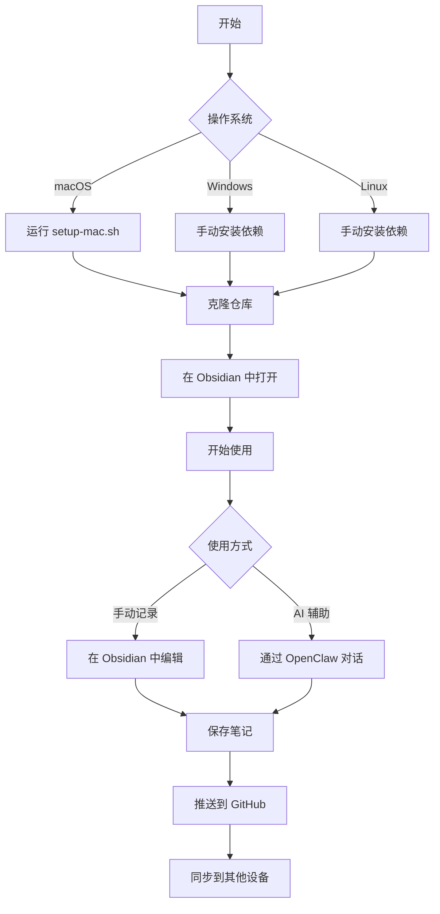

# Personal Knowledge Wiki

> 基于 [Andrej Karpathy's LLM Wiki 理念](https://karpathy.github.io/2025/05/11/llm-wiki/) 构建的个人知识库系统

[](https://github.com/cpufreestyle/my-wiki/releases/tag/v2.0.0)
[](LICENSE)
[](https://obsidian.md)

---

## 📖 目录

- [核心思想](#核心思想)
- [涉及的软件](#涉及的软件)
- [快速开始](#快速开始)
- [详细安装指南](#详细安装指南)
- [操作流程](#操作流程)
- [目录结构](#目录结构)
- [功能模块](#功能模块)
- [集成工具](#集成工具)
- [本地模型支持](#本地模型支持)
- [日常使用](#日常使用)
- [故障排除](#故障排除)
- [贡献](#贡献)
- [许可证](#许可证)

---

## 🧠 核心思想

### 为什么需要 LLM Wiki？

**传统 RAG（检索增强生成）：**
- ❌ 每次查询都重新检索和推理
- ❌ 不保留历史推导结果
- ❌ 重复计算，效率低

**LLM Wiki（持久化知识库）：**
- ✅ 增量构建持久化知识结构
- ✅ 知识累积而非重复推导
- ✅ 随着使用越来越智能

### 工作原理

```
┌───────────────┐
│   用户信息    │
│ (对话/笔记)   │
└───────┬───────┘
        │
        ▼
┌───────────────┐
│   OpenClaw    │
│  (AI Agent)   │
└───────┬───────┘
        │
        ├───▶ 读取 wiki 笔记
        ├───▶ 更新/创建笔记
        └───▶ 自动抓取内容
        │
        ▼
┌───────────────┐
│   Obsidian    │
│   (Vault)     │
└───────────────┘
```

---

## 💻 涉及的软件

### 必需软件

| 软件 | 版本 | 用途 | 安装 |
|------|------|------|------|
| **Git** | 2.30+ | 版本控制、同步 | [git-scm.com](https://git-scm.com) |
| **Python** | 3.8+ | 运行自动化脚本 | [python.org](https://python.org) |
| **Obsidian** | 1.0+ | Markdown 笔记管理 | [obsidian.md](https://obsidian.md) |
| **OpenClaw** | latest | AI Agent（可选） | [openclaw.ai](https://openclaw.ai) |

### 可选软件

| 软件 | 用途 | 说明 |
|------|------|------|
| **GitHub CLI (gh)** | 创建 Release | 可选，手动也能创建 |
| **VS Code** | 编辑 Markdown | 可以用任何编辑器替代 |

### Python 依赖

```bash
# 必需
beautifulsoup4>=4.11.0
markdown>=3.4.0
python-dateutil>=2.8.0
requests>=2.28.0

# 可选
feedparser>=6.0.0  # RSS 抓取
```

---

## 🚀 快速开始

### 1 分钟快速体验

```bash
# 克隆仓库
git clone https://github.com/cpufreestyle/my-wiki.git
cd my-wiki

# macOS: 运行自动设置脚本
./scripts/setup-mac.sh

# Windows: 手动安装依赖
pip install -r requirements.txt

# 在 Obsidian 中打开
# Open Folder as Vault → 选择当前文件夹
```

---

## 📦 详细安装指南

### macOS 安装

#### 步骤 1: 安装必需软件

**1. 安装 Git**
```bash
# 使用 Homebrew
brew install git

# 或下载安装包
# https://git-scm.com/download/mac
```

**2. 安装 Python 3**
```bash
# 使用 Homebrew
brew install python@3.11

# 或下载官方安装包
# https://www.python.org/downloads/macos/
```

**3. 安装 Obsidian**
```bash
# 使用 Homebrew
brew install --cask obsidian

# 或下载 .dmg
# https://obsidian.md/download
```

**4. 验证安装**
```bash
git --version
python3 --version
obsidian --version  # 如果命令行启动不行，直接从 Applications 打开
```

#### 步骤 2: 克隆仓库并运行设置脚本

```bash
# 克隆仓库
git clone https://github.com/cpufreestyle/my-wiki.git
cd my-wiki

# 运行 Mac 自动设置脚本
./scripts/setup-mac.sh
```

**设置脚本会自动：**
- ✅ 检测 Python 3 和 pip3
- ✅ 安装 Python 依赖
- ✅ 设置脚本权限
- ✅ 检测 Obsidian 安装
- ✅ 为现有笔记添加 YAML frontmatter
- ✅ 创建必要文件夹

#### 步骤 3: 在 Obsidian 中打开

1. 打开 Obsidian
2. 点击 **"Open folder as vault"**
3. 选择 `/path/to/my-wiki` 文件夹
4. 给 vault 起个名字（推荐：`my-wiki`）
5. 完成！

---

### Windows 安装

#### 步骤 1: 安装必需软件

**1. 安装 Git**
- 下载：https://git-scm.com/download/win
- 安装时选择 "Use Git from the command line and also from 3rd-party software"

**2. 安装 Python 3**
- 下载：https://www.python.org/downloads/windows/
- **重要**：安装时勾选 "Add Python to PATH"

**3. 安装 Obsidian**
- 下载：https://obsidian.md/download
- 安装 `.exe` 文件

#### 步骤 2: 克隆仓库并安装依赖

```bash
# 克隆仓库
git clone https://github.com/cpufreestyle/my-wiki.git
cd my-wiki

# 安装 Python 依赖
pip install -r requirements.txt

# 为现有笔记添加 frontmatter（可选）
python scripts/add_frontmatter.py
```

#### 步骤 3: 在 Obsidian 中打开

1. 打开 Obsidian
2. 点击 **"Open folder as vault"**
3. 选择 `C:\path\to\my-wiki` 文件夹
4. 给 vault 起个名字
5. 完成！

---

### Linux 安装

```bash
# 安装依赖 (Ubuntu/Debian)
sudo apt update
sudo apt install git python3 python3-pip obsidian

# 克隆仓库
git clone https://github.com/cpufreestyle/my-wiki.git
cd my-wiki

# 安装 Python 依赖
pip3 install -r requirements.txt

# 运行设置脚本（如果适用）
./scripts/setup-mac.sh  # 可能需要修改以适应 Linux
```

---

## 🔄 操作流程

### 完整工作流



---

### 日常操作流程

#### 场景 1: 手动记录笔记

```
1. 打开 Obsidian
   ↓
2. 按 Cmd+P → "Daily notes: Open today's note"
   ↓
3. 编辑笔记（添加想法、链接、标签）
   ↓
4. 保存 (Cmd+S)
   ↓
5. 推送到 GitHub (可选)
   git add .
   git commit -m "Update notes"
   git push
```

#### 场景 2: 通过 OpenClaw 自动记录

```
1. 与 OpenClaw 对话
   "今天的会议讨论了..."
   ↓
2. OpenClaw 自动提取关键信息
   ↓
3. OpenClaw 更新相关 wiki 页面
   - 每日笔记 (daily/YYYY-MM-DD.md)
   - 项目页面 (projects/*.md)
   - 人物页面 (people/*.md)
   ↓
4. 在 Obsidian 中查看更新
```

#### 场景 3: 自动抓取内容

```
每 2 小时 (Heartbeat):
   ↓
1. 运行 auto_fetch.py
   - 抓取 GitHub 提交
   - 抓取 RSS 订阅
   ↓
2. 生成 Markdown 文件
   - daily/rss/YYYY-MM-DD-*.md
   - projects/*-updates.md
   ↓
3. 更新索引 (update_index.py)
   ↓
4. 推送到 GitHub
```

---

## 📁 目录结构

```
my-wiki/
├── README.md                      # 本文件 (v2.0)
├── INDEX.md                       # 知识索引（自动生成）
├── wiki_tool.py                   # 统一工具入口 (v2.0)
├── modules/                       # 功能模块 🆕
│   ├── video-analysis/            # 视频分析
│   │   ├── README.md
│   │   └── analyze.py
│   ├── memo-sync/                 # Memo 同步
│   │   ├── README.md
│   │   └── sync.py
│   ├── obsidian-sync/             # Obsidian 双 Vault 同步
│   │   ├── README.md
│   │   └── sync.py
│   └── a2a-agent/                 # A2A Agent 网络文档
│       └── README.md
├── .obsidian/                     # Obsidian 配置
│   ├── app.json                   # 应用设置
│   ├── templates/                 # 模板
│   │   ├── daily-note.md         # 每日笔记模板
│   │   └── project.md            # 项目笔记模板
│   └── ...
├── daily/                         # 每日笔记
│   ├── 2026-07-01.md             # 今日笔记
│   ├── 2026-05-22.md             # 历史笔记
│   └── rss/                       # RSS 抓取内容
│       └── 2026-05-27-github-*.md
├── projects/                      # 项目页面
│   ├── my-wiki.md                 # 本项目
│   ├── stock-crewai.md            # 股票交易系统
│   └── *-updates.md               # 项目更新日志
├── concepts/                      # 概念/技术
│   ├── LLM_Wiki.md                # LLM Wiki 理念
│   └── RAG_vs_Wiki.md             # RAG vs Wiki 对比
├── people/                        # 人物页面
│   └── Michael_Qiu.md             # 人物笔记
├── scripts/                       # 自动化脚本
│   ├── setup-mac.sh               # Mac 设置脚本
│   ├── auto_fetch.py              # 自动抓取
│   ├── fetch_rss.py               # RSS 抓取
│   ├── update_index.py            # 更新索引
│   ├── add_frontmatter.py         # 添加 frontmatter
│   └── generate_obsidian_uri.py   # 生成 Obsidian URI
├── attachments/                   # 附件（图片等）
├── requirements.txt               # Python 依赖
└── .gitignore                     # Git 忽略规则
```

---

## 🔌 功能模块

MyWiki v2.0 集成以下功能模块，位于 `modules/` 目录：

### 模块列表

| 模块 | 目录 | 功能 |
|------|------|------|
| **Video Analysis** | `modules/video-analysis/` | FFmpeg 帧提取 + Vision 逐帧分析 → Markdown 报告 |
| **Memo Sync** | `modules/memo-sync/` | 与本地 Memo (MemoAI) 应用双向同步 |
| **Obsidian Sync** | `modules/obsidian-sync/` | 多 Vault 同步（Documents + Wiki） |
| **A2A Agent** | `modules/a2a-agent/` | Google A2A 协议 Agent 网络文档索引 |

### 模块使用

```bash
# 视频分析
python wiki_tool.py video <video_path> --interval 30 --title "标题"

# Memo 同步
python wiki_tool.py memo-push <file.md> --title "标题"
python wiki_tool.py memo-list
python wiki_tool.py memo-search "关键词"
python wiki_tool.py memo-pull

# Obsidian 双 Vault 同步
python wiki_tool.py sync-obsidian              # 同步到所有 Vault
python wiki_tool.py sync-obsidian --vault documents  # 仅 Documents
```

### 模块架构

```
modules/
├── video-analysis/
│   ├── README.md          # 模块文档
│   └── analyze.py         # 视频分析入口（ffprobe → ffmpeg → 采样 → 报告）
├── memo-sync/
│   ├── README.md          # 模块文档
│   └── sync.py            # Memo SQLite 同步脚本
├── obsidian-sync/
│   ├── README.md          # 模块文档
│   └── sync.py            # 多 Vault 同步脚本
└── a2a-agent/
    └── README.md          # A2A 网络文档索引
```

---

## 🛠 集成工具

### wiki_tool.py v2.0

统一的命令行入口，集成所有模块：

```bash
# 基础命令
python wiki_tool.py update                    # 更新 INDEX.md
python wiki_tool.py daily                     # 创建今日笔记
python wiki_tool.py search <query>            # 搜索 wiki

# 模块命令
python wiki_tool.py video <path> [opts]       # 视频分析
python wiki_tool.py memo-push <file> [opts]   # 推送到 Memo
python wiki_tool.py memo-list                 # 列出 Memo 文档
python wiki_tool.py memo-search <keyword>     # 搜索 Memo
python wiki_tool.py memo-pull                 # 从 Memo 拉取
python wiki_tool.py sync-obsidian [opts]      # 同步到 Obsidian
```

---

## ✨ 功能特性

### 1. Obsidian 集成

- ✅ **完整配置**：预设的 Obsidian 设置（`.obsidian/app.json`）
- ✅ **核心插件**：templates, daily-notes, calendar, dataview, tag-pane, outline
- ✅ **笔记模板**：每日笔记和项目笔记模板
- ✅ **YAML Frontmatter**：所有笔记包含元数据（title, date, tags, type）

### 2. 自动化脚本

- ✅ **自动抓取**：从 GitHub、RSS 自动抓取内容
- ✅ **自动索引**：自动生成和更新知识索引
- ✅ **自动标签**：自动提取标签
- ✅ **每周回顾**：自动生成每周摘要

### 3. OpenClaw 联动

- ✅ **读取笔记**：OpenClaw 可以直接读取 wiki 笔记
- ✅ **更新笔记**：OpenClaw 可以创建和更新笔记
- ✅ **智能搜索**：基于内容的语义搜索
- ✅ **自动总结**：自动生成项目摘要和技术回顾

### 4. 跨平台支持

- ✅ **macOS**：自动设置脚本（`setup-mac.sh`）
- ✅ **Windows**：详细安装指南
- ✅ **Linux**：兼容（可能需要手动配置）

### 5. Git 同步

- ✅ **版本控制**：所有更改可追溯
- ✅ **多设备同步**：通过 GitHub 同步
- ✅ **自动推送**：定时推送到远程仓库
- ✅ **备份**：Gitee 备份（可选）

### 6. 本地模型支持 🆕

- ✅ **隐私保护**：数据不离开本地，完全离线运行
- ✅ **多解决方案**：支持 Ollama、LM Studio、GPT4All、llama.cpp
- ✅ **OpenAI 兼容 API**：轻松集成到 OpenClaw 和 Obsidian
- ✅ **成本节约**：无 API 费用，一次性硬件投入
- ✅ **详细指南**：查看 [LOCAL-MODELS.md](LOCAL-MODELS.md)

**快速开始（Ollama）**：
```bash
# 安装 Ollama
brew install ollama

# 启动服务
ollama serve &

# 拉取模型
ollama pull llama3

# 配置 OpenClaw 使用本地模型
# 编辑 ~/.config/openclaw/config.yaml
```

---

## 📝 日常使用

### 常用命令

#### 在 Obsidian 中

| 快捷键 | 功能 | 说明 |
|--------|------|------|
| `Cmd+O` | Quick Switcher | 快速打开笔记 |
| `Cmd+P` | Command Palette | 执行命令 |
| `Cmd+E` | 切换编辑/预览 | 切换源码和预览模式 |
| `Cmd+Shift+F` | 搜索 | 全局搜索 |
| `Cmd+Option+←/→` | 前进/后退 | 导航历史 |

#### 通过 OpenClaw

```bash
# 告诉 OpenClaw 新信息
"今天学习了 Obsidian 的 Dataview 插件，它可以..."

# 查询知识
"我的 wiki 里有哪些关于 LLM 的笔记？"

# 生成报告
"生成本周的知识回顾"
```

#### Git 同步

```bash
# 查看状态
git status

# 提交更改
git add .
git commit -m "Update notes"

# 推送到 GitHub
git push origin main

# 从 GitHub 拉取
git pull origin main
```

---

## 🛠️ 故障排除

### 问题 1: Obsidian 找不到 vault

**错误**：`Unable to find a vault for the URL obsidian://open?vault=xxx`

**解决**：
1. 检查 vault 名称是否正确
2. 查看 `HOW-TO-FIND-VAULT-NAME.md`
3. 使用 Quick Switcher（`Cmd+O`）而非 URI

---

### 问题 2: Python 脚本无法运行

**错误**：`ModuleNotFoundError: No module named 'beautifulsoup4'`

**解决**：
```bash
# 重新安装依赖
pip install -r requirements.txt

# 或使用 macOS 设置脚本
./scripts/setup-mac.sh
```

---

### 问题 3: Git 推送失败

**错误**：`Authentication failed`

**解决**：
1. 使用 SSH 而非 HTTPS
2. 配置 GitHub Personal Access Token
3. 查看 [GitHub 文档](https://docs.github.com/en/authentication)

---

### 问题 4: Frontmatter 格式错误

**错误**：Obsidian 无法识别 tags

**解决**：
- 确保使用正确的 YAML 格式
- tags 应该是数组：`tags: ['daily', 'test']`
- 查看 `daily/2026-07-01.md` 作为示例

---

## 🤝 贡献

欢迎贡献！请查看 [CONTRIBUTING.md](CONTRIBUTING.md)（待创建）。

### 如何贡献

1. Fork 本仓库
2. 创建你的特性分支 (`git checkout -b feature/AmazingFeature`)
3. 提交你的更改 (`git commit -m 'Add some AmazingFeature'`)
4. 推送到分支 (`git push origin feature/AmazingFeature`)
5. 打开一个 Pull Request

---

## 📄 许可证

本项目采用 MIT 许可证 - 查看 [LICENSE](LICENSE) 文件了解详情。

---

## 🙏 致谢

- [Andrej Karpathy](https://karpathy.github.io) - LLM Wiki 理念
- [Obsidian](https://obsidian.md) - 优秀的 Markdown 笔记工具
- [OpenClaw](https://openclaw.ai) - AI Agent 框架

---

## 📞 联系方式

- **GitHub Issues**: [创建 Issue](https://github.com/cpufreestyle/my-wiki/issues)
- **Discussions**: [参与讨论](https://github.com/cpufreestyle/my-wiki/discussions)

---

## 🔗 相关链接

- **仓库**: https://github.com/cpufreestyle/my-wiki
- **Release**: https://github.com/cpufreestyle/my-wiki/releases
- **Obsidian 文档**: https://help.obsidian.md
- **OpenClaw 文档**: https://docs.openclaw.ai

---

**最后更新**: 2026-07-08

**版本**: v2.0.0
